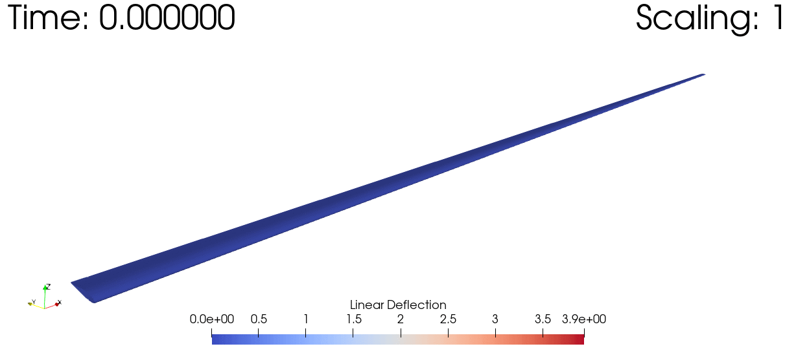

# Using GXBeam with DifferentialEquations.jl

While the capabilities provided by GXBeam are probably sufficient for most users, advanced users may wish to make use of some of the features of the [`DifferentialEquations`](https://github.com/SciML/DifferentialEquations.jl) package.  For this reason, we have created an interface in GXBeam to allow users to model the differential algebraic equations encountered in GXBeam in DifferentialEquations.

```@contents
Pages = ["diffeq.md"]
Depth = 3
```

## GXBeam to DifferentialEquations Interface Functions

The following constructors are available for modeling the differential algebraic equations from GXBeam in DifferentialEquations.

```@docs
GXBeam.DAEFunction(system::System, assembly; kwargs...)
GXBeam.DAEProblem(system::System, assembly, tspan; kwargs...)
```

## Example Usage of GXBeam with DifferentialEquations

For this example we demonstrate how to solve the [Nonlinear Dynamic Analysis of a Wind Turbine Blade](@ref) problem using DifferentialEquations.

We start by setting up the problem as if we were solving the problem using GXBeam's internal solver.

```@example diffeq
using GXBeam, LinearAlgebra

L = 60 # m

# create points
nelem = 10
x = range(0, L, length=nelem+1)
y = zero(x)
z = zero(x)
points = [[x[i],y[i],z[i]] for i = 1:length(x)]

# index of endpoints of each beam element
start = 1:nelem
stop = 2:nelem+1

# stiffness matrix for each beam element
stiffness = fill(
    [2.389e9  1.524e6  6.734e6 -3.382e7 -2.627e7 -4.736e8
     1.524e6  4.334e8 -3.741e6 -2.935e5  1.527e7  3.835e5
     6.734e6 -3.741e6  2.743e7 -4.592e5 -6.869e5 -4.742e6
    -3.382e7 -2.935e5 -4.592e5  2.167e7 -6.279e5  1.430e6
    -2.627e7  1.527e7 -6.869e5 -6.279e5  1.970e7  1.209e7
    -4.736e8  3.835e5 -4.742e6  1.430e6  1.209e7  4.406e8],
    nelem)

# mass matrix for each beam element
mass = fill(
    [258.053      0.0        0.0      0.0      7.07839  -71.6871
       0.0      258.053      0.0     -7.07839  0.0        0.0
       0.0        0.0      258.053   71.6871   0.0        0.0
       0.0       -7.07839   71.6871  48.59     0.0        0.0
       7.07839    0.0        0.0      0.0      2.172      0.0
     -71.6871     0.0        0.0      0.0      0.0       46.418],
     nelem)

# create assembly of interconnected nonlinear beams
assembly = Assembly(points, start, stop; stiffness=stiffness, mass=mass)

# prescribed conditions
prescribed_conditions = (t) -> begin
    Dict(
        # fixed left side
        1 => PrescribedConditions(ux=0, uy=0, uz=0, theta_x=0, theta_y=0, theta_z=0),
        # force on right side
        nelem+1 => PrescribedConditions(Fz = 1e5*sin(20*t))
    )
end

nothing #hide
```

At this point if we wanted to use GXBeam's internal solver, we would choose a time discretization and call the `time_domain_analysis` function.

```@example diffeq
# simulation time
t = 0:0.001:2.0

system, gxbeam_history, converged = time_domain_analysis(assembly, t;
    prescribed_conditions = prescribed_conditions)

nothing #hide
```

To instead use the capabilities of the DifferentialEquations package we can do the following.

```@example diffeq
using DifferentialEquations

# define simulation time
tspan = (0.0, 2.0)

# run initial condition analysis to get consistent set of initial conditions
system, converged = initial_condition_analysis(assembly, tspan[1]; prescribed_conditions)

# construct DAEProblem
prob = DAEProblem(system, assembly, tspan; prescribed_conditions)

# solve DAEProblem
sol = solve(prob, DABDF2())

nothing #hide
```

We can extract the outputs from the solution in a easy to understand format using the [`AssemblyState`](@ref) constructor.

```@example diffeq

diffeq_history = [AssemblyState(system, assembly, sol[it]; prescribed_conditions)
    for it in eachindex(sol)]

nothing #hide
```

Let's now compare the solutions from GXBeam's internal solver and the default DAE solver from DifferentialEquations.

```@example diffeq
using Plots
pyplot()

point = vcat(fill(nelem+1, 6), fill(1, 6))
field = [:u, :u, :u, :theta, :theta, :theta, :F, :F, :F, :M, :M, :M]
direction = [1, 2, 3, 1, 2, 3, 1, 2, 3, 1, 2, 3]
ylabel = ["\$u_x\$ (\$m\$)", "\$u_y\$ (\$m\$)", "\$u_z\$ (\$m\$)",
    "Rodriguez Parameter \$\\theta_x\$ (degree)",
    "Rodriguez Parameter \$\\theta_y\$ (degree)",
    "Rodriguez Parameter \$\\theta_z\$ (degree)",
    "\$F_x\$ (\$N\$)", "\$F_y\$ (\$N\$)", "\$F_z\$ (\$N\$)",
    "\$M_x\$ (\$Nm\$)", "\$M_y\$ (\$Nm\$)", "\$M_z\$ (\$N\$)"]

for i = 1:12
    local y #hide
    plot(
        xlim = (0, 2.0),
        xticks = 0:0.5:2.0,
        xlabel = "Time (s)",
        ylabel = ylabel[i],
        grid = false,
        overwrite_figure=false
        )
    y_gxbeam = [getproperty(state.points[point[i]], field[i])[direction[i]]
        for state in gxbeam_history]

    y_diffeq = [getproperty(state.points[point[i]], field[i])[direction[i]]
        for state in diffeq_history]

    if field[i] == :theta
        # convert to Rodriguez parameter
        @. y_gxbeam = 4*atan(y_gxbeam/4)
        @. y_diffeq = 4*atan(y_diffeq/4)
        # convert to degrees
        @. y_gxbeam = rad2deg(y_gxbeam)
        @. y_diffeq = rad2deg(y_diffeq)
    end

    if field[i] == :F || field[i] == :M
        y_gxbeam = -y_gxbeam
        y_diffeq = -y_diffeq
    end

    plot!(t, y_gxbeam, label="GXBeam")
    plot!(sol.t, y_diffeq, label="DifferentialEquations")
    plot!(show=true)
    savefig("dynamic-wind-turbine-diffeq-"*string(field[i])*string(direction[i])*".svg"); nothing #hide
end
```


The solutions provided by GXBeam and DifferentialEquations track closely with each other at first, then drift further apart as the dynamics become more and more chaotic.

```julia
write_vtk("dynamic-wind-turbine", assembly, gxbeam_history, sol.t)
```


